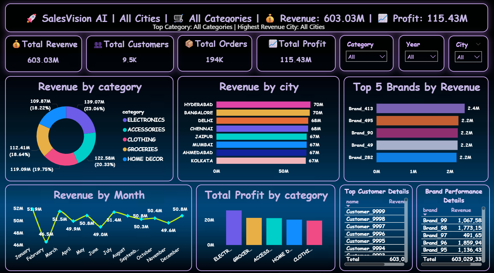
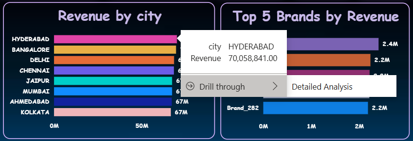
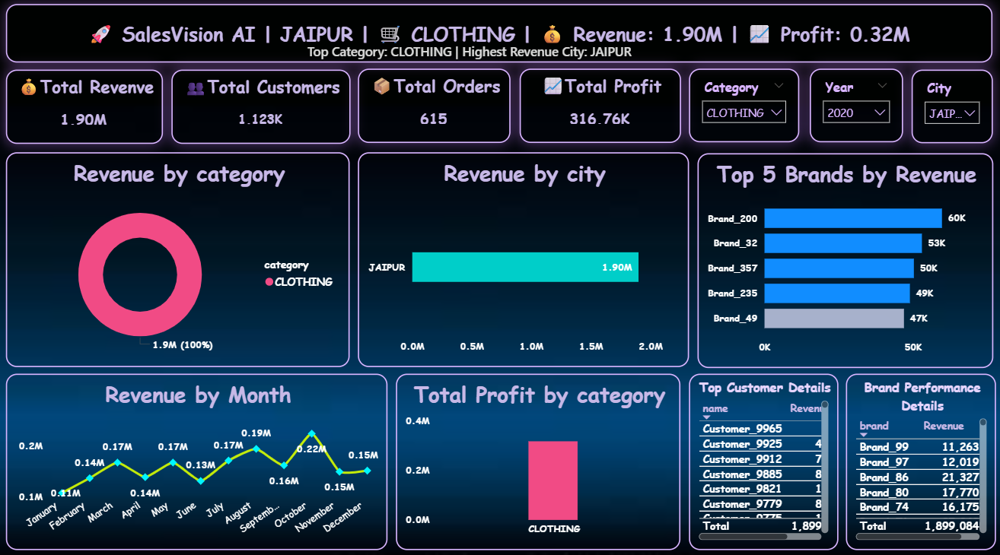

# 🚀 SalesVision-AI

AI-Powered Interactive Business Intelligence Dashboard built with Power BI.

---

## 📌 Project Overview

SalesVision-AI is a modern business intelligence dashboard designed to transform raw sales data into actionable insights.

This project focuses on:
- Interactive analytics
- Business storytelling
- KPI monitoring
- Drill-through analysis
- Dynamic insights
- AI-style dashboard experience

---

## 📊 Features

✅ Interactive Dashboard  
✅ Dynamic KPI Cards  
✅ Business Insights  
✅ Drill-through Analysis  
✅ Revenue & Profit Tracking  
✅ Category-wise Performance  
✅ Customer Segment Analysis  
✅ Monthly Sales Trends  

---

## 🛠 Tools & Technologies

- Power BI
- DAX
- Power Query
- Excel
- Data Visualization
- Business Intelligence

---

## 📷 Dashboard Preview

### 🔹 Main Dashboard

### 🔹 Drill-through Analysis

### 🔹 KPI Insights

---

## 🎯 Business Goal

The objective of this project is to help businesses:
- Track performance
- Identify growth opportunities
- Monitor KPIs
- Make data-driven decisions

---

## 👨‍💻 Author

**Ram Babu**  
B.Tech CSE (AI/ML)  
Power BI • SQL • Python • AI/ML
